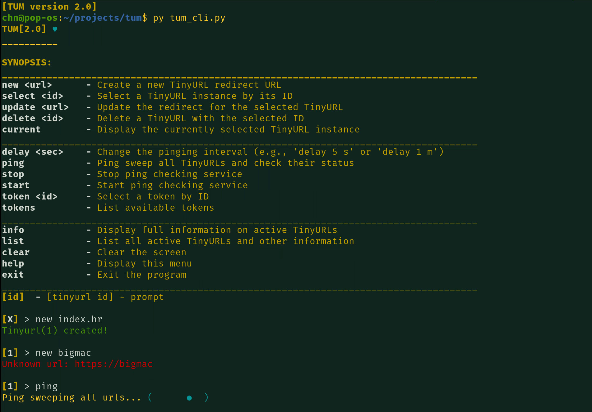

## TUM - Tinyurl manager

## Overview
 This package contains modern CLI for managing, generating, analyzing and automating everything concerning your tinyurls and their end target destination. 
 
It features interactive ***Heartbeat*** service which serves as a validator that regularly performs checks on your tinyurls. 

 It has very customized and tailored API which makes it a very powerful tool even if you don't use Tum CLI. 

### Prerequisites

**Python 3**+ - mandatory interpreter

**Gnome/xfce-4 terminal** - Required for heartbeat service

### Installation

***
In your directory where you cloned this repository do this:

```sudo apt install python3``` - Install python3 with apt

```pip install -r requirements.txt``` - Install python dependencies

```python3.10 main.py``` - Run tum cli with python3+ interpreter
***
If you just want to integrate tinyurl api into your python project to create, update, load and create tinyurls from lists, display information and more do the following:

```pip install /project/path/``` - Now tinyurl packages will be installed along any necessary dependencies

```import tinyurl ``` - import tinyurl package

```tum = tinyurl.TinyUrlManager(app_config=your_config) ```

```result = tum.create_from_list(urls)``` - example function

***
### Configuration

Path for base configuration file is project directory ***./config.ini***

Everything regarding app configuration is located here.

Put your ***tokens.txt*** and optionally urls.txt file in this(project) directory.


***
### Command line interface


*Available commands in CLI  :*
_____________________________________________________________________________________
`new <url>`      - Create a new TinyURL redirect URL

`select <id>`    - Select a TinyURL instance by its ID

`update <url>`   - Update the redirect for the selected TinyURL

`delete <id>`    - Delete a TinyURL with the selected ID

`current`        - Display the currently selected TinyURL instance(selector for update and delete commands)
_____________________________________________________________________________________
`delay <sec>`    - Change the pinging interval (e.g., 'delay 5s' or 'delay 1m')

`ping`           - Ping sweep all TinyURLs and check their status

`stop`           - Stop and close ping checking service

`start`          - Start and close ping checking service

`token <id>`     - Select a token by ID

`tokens`         - List available tokens
_____________________________________________________________________________________
`info`           - Display full information on active TinyURLs

`list`           - List all active TinyURLs and other information

`clear`          - Clear the screen

`help`           - Display this menu

`exit`           - Exit the program
_____________________________________________________________________________________

#### How does cli look like in gnome-terminal...

### Heartbeat service
Imagine uploading...O

### Contributing

We welcome contributions to improve and enhance this project! To contribute, follow these steps:

### License
This project is licensed under the MIT License.

### Contact
If you have any suggestions, feedback, don't hesitate reach out.